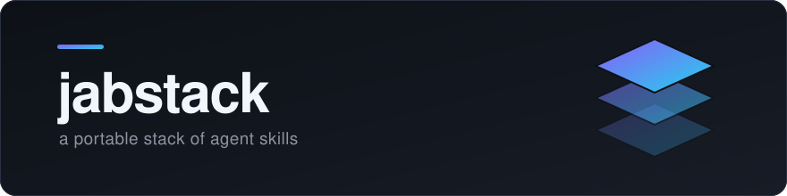

<p align="center">
  
</p>

<p align="center">
  A portable <a href="https://agent-plugins.org/">Agent Plugin</a> — reusable Agent Skills that work in
  ChatGPT Work, Codex, Claude Code, and other compatible agent clients.
</p>

---

## Install

The fastest way is [skills.sh](https://www.skills.sh). No clone, no config:

```bash
npx skills add jabreeflor/jabstack
```

You get an interactive picker — choose the skills you want, then the agents to install them
into. It auto-detects the agents already set up on your machine.

**What that looks like when it's done.** The skill is copied into your agent's own skills
directory, right inside the project:

```
your-project/
└── .claude/
    └── skills/
        └── gauntlet-loop/
            └── SKILL.md
```

That's the whole install. Restart your agent and `/gauntlet-loop` is there.

### Other ways to run it

```bash
# See what's in here without installing anything
npx skills add jabreeflor/jabstack --list

# Grab one skill, skip the prompts
npx skills add jabreeflor/jabstack --skill gauntlet-loop -y

# Target a specific agent
npx skills add jabreeflor/jabstack -a claude-code

# Install globally (~/.claude/skills) instead of into this project
npx skills add jabreeflor/jabstack -g
```

And once it's installed:

```bash
npx skills list                 # what you have
npx skills update               # pull the latest versions
npx skills remove gauntlet-loop # uninstall
```

### As a ChatGPT Work or Codex plugin

The OpenAI manifest lives at `.codex-plugin/plugin.json` and loads both skills from
`./skills/`. This follows the [OpenAI plugin format](https://learn.chatgpt.com/docs/build-plugins).

Use this repository's `jabstack/` folder, or extract a supplied plugin ZIP.
In ChatGPT Work, ask `@plugin-creator` to add that folder to your
local marketplace; in Codex, use `$plugin-creator`. Install Jabstack from the
Plugins Directory, then start a new conversation with it enabled. See OpenAI's
[installation and testing guide](https://developers.openai.com/plugins/deploy/connect-chatgpt).

Try “Run the gauntlet on my project” or “Create a visual explainer for my pull request.”
Gauntlet needs independent subagents and web access. PR artifacts need repository
access, screenshot tools, hosting, and authenticated GitHub write access to complete
publication. The skills use available host tools and report unavailable steps.
The archive is an export for local installation, not a published directory listing.

### As a Claude Code plugin (skills + the agent, per project)

The repo is also its own single-plugin Claude Code marketplace
(`.claude-plugin/marketplace.json`). To install it interactively:

```
/plugin marketplace add jabreeflor/jabstack
/plugin install jabstack@jabstack
```

To pin it to a project so every contributor and every Claude Code session gets it, put this in
the project's `.claude/settings.json` (this is what [jabot](https://github.com/jabreeflor/jabot)
does):

```json
{
  "extraKnownMarketplaces": {
    "jabstack": {
      "source": { "source": "github", "repo": "jabreeflor/jabstack" }
    }
  },
  "enabledPlugins": {
    "jabstack@jabstack": true
  }
}
```

Claude Code prompts to install the plugin on the next session start. Unlike `npx skills`,
this route ships the `gauntlet-critic` subagent too.

### Or clone the whole plugin

To point any other agent client at the directory:

```bash
git clone https://github.com/jabreeflor/jabstack.git
```

## Skills

| Skill | What it does |
|---|---|
| [`gauntlet-loop`](skills/gauntlet-loop/SKILL.md) | Turns a short topic into a reference-grade build: benchmarked against a real shipped product, subagent fan-out across every quality domain, a per-domain loop with an independent harsh critic, and blind A/B judging until every critic picks our version. |
| [`create-pr-artifact`](skills/create-pr-artifact/SKILL.md) | Creates a standalone HTML PR walkthrough in any agent harness, screenshots the rendered document, and adds the screenshots to the PR body only with a working walkthrough link. Uses available hosting and GitHub upload tools. |

Run them as `/gauntlet-loop <topic>` or `/create-pr-artifact [PR]`, or just ask to "gauntlet"
something / "add an artifact to the PR".

## Layout

```
jabstack/
├── plugin.json            # manifest (Agent Plugins 1.0.0)
├── .codex-plugin/
│   └── plugin.json        # ChatGPT Work and Codex manifest
├── .claude-plugin/
│   ├── plugin.json        # the same manifest, where Claude Code looks for it
│   └── marketplace.json   # makes this repo installable via /plugin or settings.json
├── skills/                # the portable core — one directory per skill
│   ├── gauntlet-loop/SKILL.md
│   └── create-pr-artifact/SKILL.md
├── AGENTS.md              # shared plugin maintenance and version sync policy
├── CLAUDE.md              # imports the shared maintenance policy
└── agents/                # native Claude agent; reference instructions elsewhere
    └── gauntlet-critic.md
```

Keep all three manifests and the Claude marketplace's plugin entry on the same
plugin name and release version. Shared skills, capability descriptions, and
supplied exports must stay in sync, while each manifest retains its format-specific
fields. See [AGENTS.md](AGENTS.md) for the shared maintenance policy;
[CLAUDE.md](CLAUDE.md) imports the same policy.

Agent Plugins v1 defines only **skills** and **MCP servers** as portable —
commands, hooks, and agents are [out of scope](https://agent-plugins.org/specification).
So `gauntlet-critic` ships in Claude Code's native `agents/` location. Clients that don't
read `agents/` just ignore it, and `gauntlet-loop` still works — it falls back to a generic
critic subagent instead of the tuned one.

## Adding a skill

Create `skills/<skill-name>/SKILL.md`:

```markdown
---
name: my-skill
description: What it does and when the agent should reach for it.
---

Instructions the agent follows when this skill loads.
```

Three rules:

1. `name` must match the directory name.
2. `description` is what an agent matches against — write it as "do X when Y", not as a title.
3. Only `name`, `description`, `license`, `compatibility`, `metadata`, and `allowed-tools`
   are allowed in frontmatter. Anything else is a fatal validation error and the skill gets
   skipped **silently**. Client-specific fields like `argument-hint` go under `metadata`.

Validate before committing:

```bash
npx skills-ref validate ./skills/my-skill
```

## License

MIT — see [LICENSE](LICENSE).
