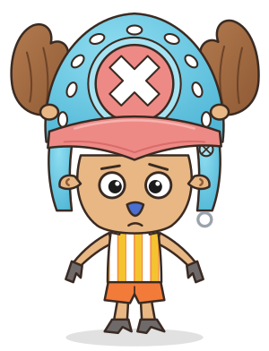

<p align="center">
  
</p>

# jabstack

Portable agent skills for Claude Code, Codex, ChatGPT Work, Cursor, and any
[Agent Plugins](https://agent-plugins.org/) client.

## Install

```bash
npx skills add jabreeflor/jabstack
```

Claude Code (includes the `gauntlet-critic` agent):

```
/plugin marketplace add jabreeflor/jabstack
/plugin install jabstack@jabstack
```

Codex / ChatGPT Work load `.codex-plugin/plugin.json`; Cursor loads
`.cursor-plugin/plugin.json` (symlink the repo into `~/.cursor/plugins/local/`).

## Skills

| Skill | What it does |
|---|---|
| [`gauntlet-loop`](skills/gauntlet-loop/SKILL.md) | Builds a topic to reference grade with benchmarked, critic-judged loops. |
| [`create-pr-artifact`](skills/create-pr-artifact/SKILL.md) | Makes an HTML walkthrough of a PR and adds screenshots to its body. |

## Mods (Claude Code only)

| Mod | What it does |
|---|---|
| [`gh-refs`](mods/gh-refs/README.md) | `#github` picks an issue or PR and drops it into your prompt. |

Set `CLAUDE_CODE_ENABLE_FUNCTION_HOOKS=1`, then `/plugin install gh-refs@jabstack`.

## Contributing

See [AGENTS.md](AGENTS.md).

## License

MIT
